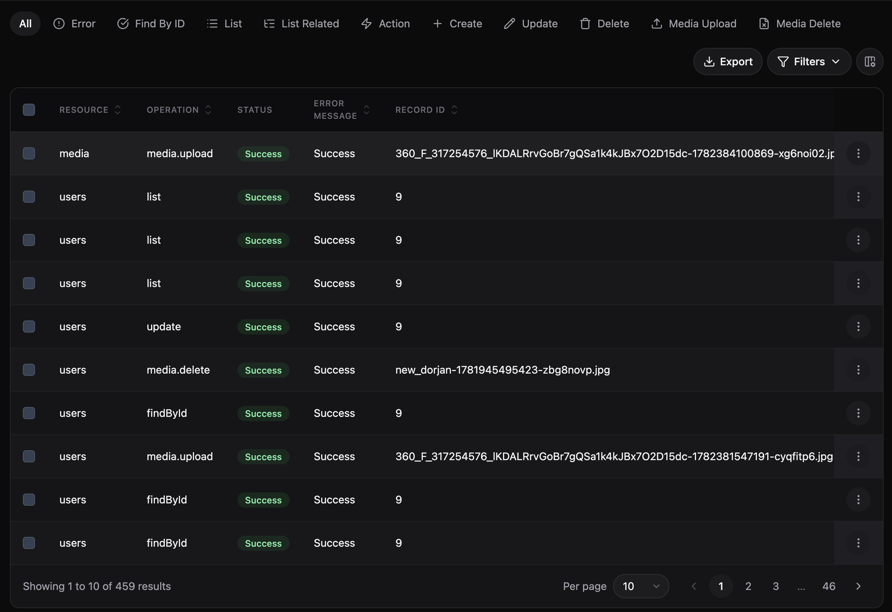

# @maxal_studio/kratosjs-plugin-logging

Adds an **audit log** to a KratosJs admin panel. Every create, update, delete, list,
view, custom action, and error across your resources — plus every **media upload and
delete** — is recorded and shown in a browsable **Logs** section. Works on both MongoDB
and SQL.



## Install

```bash
npm install @maxal_studio/kratosjs-plugin-logging
```

> Testing against a local, unpublished build of KratosJs? See
> [Developing & Testing Plugins Locally](../../nodejs-kratosjs/docs/plugins/local-development.md).

## Register

**Server** (`src/index.ts`):

```ts
import { LoggingPlugin } from '@maxal_studio/kratosjs-plugin-logging';

Panel.make('admin')
	// ...
	.resources([UserResource /* , ... */])
	.plugins([new LoggingPlugin()]);
```

Operations on the resources registered on the panel are logged automatically — there's
nothing else to wire up. This is a server-only plugin (no client entry).

Media events are logged via the panel's media lifecycle hooks under the operations
`media.upload`, `media.delete`, and `media.error` (filterable as their own tabs in the
Logs UI). Each row records the user, the resource the file belongs to (if any), the
storage key, and file metadata.
